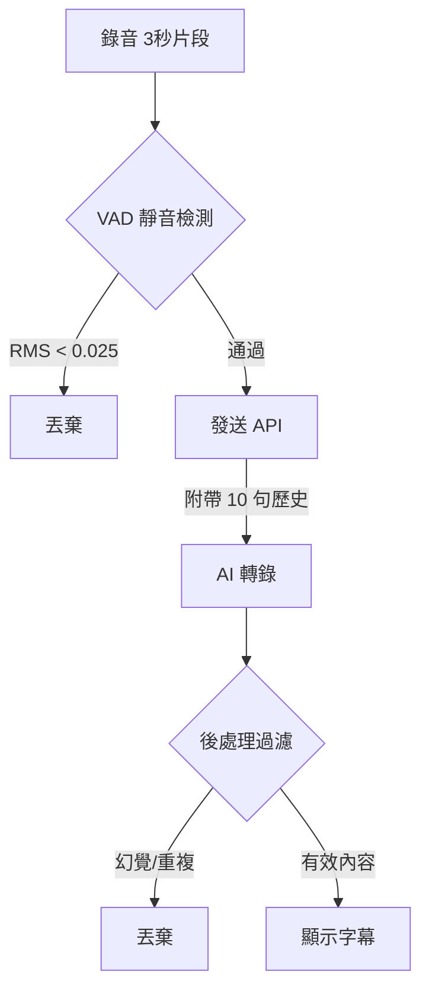

# VoiceInk - Windows Desktop Speech-to-Text Application

VoiceInk 是一款專為 Windows 桌面環境設計的語音轉文字應用程式，基於 Electron 與 OpenRouter API 構建。它提供了檔案轉錄與即時字幕功能，並針對 Windows 系統進行了深度優化，確保在各種使用場景下都能提供準確、穩定的語音辨識體驗。

## ✨ 主要功能 (Features)

### 1. 📂 檔案轉錄 (File Transcription)

- 支援拖放音訊檔案進行轉錄。
- 自動將不支援的格式（如 WebM）轉碼為 WAV (16-bit PCM) 以符合 API 規範。
- 支援長音訊處理，自動切分並處理。

### 2. 🎙️ 即時字幕 (Live Caption)

- **系統音訊擷取**：可擷取電腦系統音效（如 YouTube 影片、會議軟體聲音）。
- **即時轉錄顯示**：低延遲將語音轉為文字。
- **懸浮視窗**：
  - **置頂顯示**：始終保持在其他視窗之上。
  - **穿透模式**：背景黑色不透明，但在 Windows 上優化了視窗行為，支援拖動與調整大小。
  - **互動功能**：支援暫停/繼續、清除歷史、字體大小調整。

## 🛠️ 技術棧 (Tech Stack)

- **Core**: Electron (v35+), Node.js (v20+)
- **Frontend**: Vite, Vanilla JS, HTML/CSS
- **API**: OpenRouter API (Google Gemini 3.0 Flash)
- **Audio Processing**: Web Audio API, ffmpeg-static

## 🚀 安裝與執行 (Installation)

### 先決條件

- Node.js v20 或以上版本
- Windows 10/11 作業系統

### 開發模式

```bash
# 1. 安裝依賴
npm install

# 2. 啟動開發環境 (同時啟動 Vite Server 與 Electron)
npm run electron:dev
```

### 打包構建

```bash
# 建置 Windows 安裝檔 (.exe)
npm run electron:build
```

構建後的檔案將位於 `dist/` 目錄下。

## ⚙️ 設定 (Configuration)

本應用程式使用 **OpenRouter API** 進行語音轉錄。

1. 啟動程式後，進入「設定」頁面。
2. 在 **API Key** 欄位輸入您的 OpenRouter API Key。
3. 選擇模型（預設建議使用 `google/gemini-2.0-flash-001` 以獲得最佳速度與成本平衡）。
4. 點擊「儲存設定」。

## 📖 使用指南 (Usage)

### 即時字幕

1. 點擊主畫面的「即時字幕」按鈕。
2. 選擇要擷取的音訊來源（通常選擇「系統音訊」或特定的應用程式視窗）。
3. 點擊「開始」即可看到懸浮視窗與即時字幕。
4. 懸浮視窗可自由拖動與調整大小。

### 檔案轉錄

1. 點擊主畫面的「檔案轉錄」按鈕。
2. 將音訊檔案拖入指定區域。
3. 等待轉錄完成，結果將顯示於下方文字框，可複製或匯出。

## 🔧 核心技術細節 (Technical Details)

### 音訊處理流程


