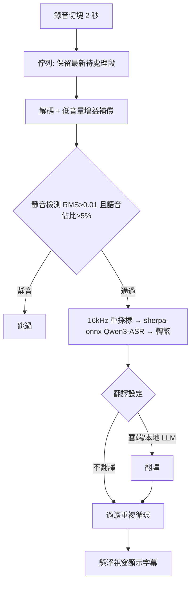

# VoiceInk — Windows 桌面語音轉文字

Electron 打造的 Windows 語音轉文字工具：**檔案轉錄**、**系統音訊即時字幕**、**翻譯與 TTS 朗讀**。
ASR 與翻譯皆可**完全離線**（本地模型，CPU 即可即時），也可改走雲端 API。

**目前版本：v1.7.0** — [下載安裝檔（GitHub Releases）](https://github.com/RX5950XT/VoiceInk/releases)

## ✨ 功能

### 📂 檔案轉錄

拖放音訊檔（MP3、WAV、M4A、FLAC、OGG、AAC…）即可轉錄。ffmpeg 串流解碼 + 28 秒/段，支援**至少 2 小時／100MB**（上限 4 小時／200MB），不整檔塞進記憶體。完成後可直接翻譯、複製或存檔。

### 🎙️ 即時字幕

擷取電腦播放的任何聲音（YouTube、會議軟體…），2 秒切塊即時轉錄並翻譯，顯示於**置頂懸浮字幕視窗**：可拖動縮放、字級 A±、透明度切換、雙語／僅翻譯切換、一鍵複製全部。狀態列音量條可確認是否擷取到音訊。

### 🌐 翻譯與 TTS

雙欄輸入／譯文頁，輸入**不限字數**（自動分段翻譯、可中途停止），⇄ 一鍵交換語言，Ctrl+Enter 送出。譯文可用 Edge TTS 朗讀（五語語音選擇、語速 -50…100）。

## 💻 模型

| 模型 | 大小 | 用途 |
|---|---|---|
| **Qwen3-ASR-0.6B** | 941 MB | 本地 ASR，52 語（含國/粵/閩語），中英夾雜與標點表現極佳 |
| **LinguaForge 0.8B Q8** | 774 MB | 本地翻譯（繁中／英／日），專門微調，預設 |
| LinguaForge 0.8B Q4 | 505 MB | 同一顆模型的小量化，CPU 約快 2.2×，代價是罕見英文專名可能被音譯 |
| Qwen3.5-0.8B | 508 MB | 本地翻譯通用多語 |

- 設定內一鍵下載（含進度、取消、刪除），存放於 `%APPDATA%/voiceink/models/`，可點擊直達資料夾。
- NVIDIA 顯卡且 VRAM ≥6GB 可開 GPU 翻譯（cuda → vulkan → CPU 自動 fallback；內建 CUDA 環境偵測與安裝）。
- 中文輸出自動轉繁體（台灣用語）。

## 🛠️ 技術棧

- **Core**：Electron 35+、Node.js 20+
- **Frontend**：Vite、Vanilla JS、HTML/CSS（無框架）
- **本地 ASR**：sherpa-onnx（ONNX Runtime，CPU int8）
- **翻譯**：node-llama-cpp（GGUF）／OpenAI 相容 chat completions
- **TTS**：Edge TTS（需連網）
- **簡繁**：opencc-js（僅在偵測到簡體時才套詞彙表）

## 🚀 開發

```bash
npm install
npm run electron:dev     # 開發（vite + electron）
npm run electron:pack    # 免安裝預覽 → dist/win-unpacked/VoiceInk.exe
npm run electron:build   # NSIS 安裝檔 → dist/
```

> 打包前請先關閉開著的 `dist/win-unpacked/VoiceInk.exe`，否則檔案被佔用會失敗。

## ⚙️ 設定

導航第四分頁「設定」，分為五區：

1. **模型**：ASR 與本地翻譯模型的下載／刪除／開資料夾。
2. **翻譯**：雲端 LLM（API URL／Key／模型 ID）或本地 LLM（選模型、GPU 開關）。
3. **語音轉文字**：本地或雲端 ASR（雲端憑證與翻譯分開設定）。
4. **外觀**：深色／淺色主題。
5. **語音**：Edge TTS 五語語音與語速。

## 🔧 即時字幕流程


```mermaid
graph TD
    A[錄音切塊 2 秒] --> Q[佇列: 保留最新待處理段]
    Q --> B[解碼 + 低音量增益補償]
    B --> C{靜音檢測 RMS>0.01 且語音佔比>5%}
    C -- 靜音 --> X[跳過]
    C -- 通過 --> E[16kHz 重採樣 → sherpa-onnx Qwen3-ASR → 轉繁]
    E --> T{翻譯設定}
    T -- 雲端/本地 LLM --> F[翻譯]
    T -- 不翻譯 --> G
    F --> G[過濾重複循環]
    G --> J[懸浮視窗顯示字幕]
```

架構與開發交接資訊見 [CONTEXT.md](./CONTEXT.md)，開發規範見 [CLAUDE.md](./CLAUDE.md) / [AGENTS.md](./AGENTS.md)。
