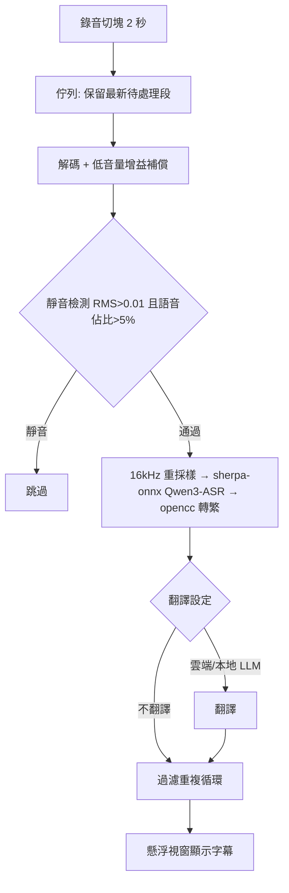

# VoiceInk - Windows 桌面語音轉文字應用程式

VoiceInk 是一款專為 Windows 桌面環境設計的語音轉文字應用程式，基於 Electron 構建。提供檔案轉錄與即時字幕功能，採**完全離線的本地 ASR**（Qwen3-ASR-0.6B），即使只有 CPU 也能即時轉錄；翻譯可選雲端或本地 LLM。

**目前版本：v1.2.0** — [下載安裝檔（GitHub Releases）](https://github.com/RX5950XT/VoiceInk/releases)

## ✨ 主要功能 (Features)

### 1. 📂 檔案轉錄 (File Transcription)

- 拖放音訊檔案即可轉錄（MP3、WAV、M4A、FLAC、OGG、AAC…）。
- 本地 ASR 自動切分長音訊（28 秒/段）逐段轉錄，再依設定翻譯。

### 2. 🎙️ 即時字幕 (Live Caption)

- **系統音訊擷取**：擷取電腦播放的任何聲音（YouTube、會議軟體等）。
- **即時轉錄**：2 秒切塊，處理佇列保證不丟失音訊段。
- **音量指示條**：一眼確認是否擷取到聲音；低音量自動增益補償。
- **懸浮字幕視窗**：置頂、可拖動縮放、字級 A±、視窗透明度切換、一鍵複製全部字幕。
- **穩定性**：錯誤直接顯示於狀態區，連續失敗自動停止；重複循環過濾。

### 3. 💻 本地模型（離線、無幻覺、CPU 即時）

| 模型 | 大小 | 語言 | 定位 |
|---|---|---|---|
| **Qwen3-ASR-0.6B** | 941 MB | 52 語（含國/粵/閩語） | 本地 ASR，中英夾雜與標點表現極佳 |
| Qwen3.5-0.8B（翻譯用） | 508 MB | 多語 | 本地 LLM 字幕翻譯，約 0.2 秒/句 |

- 設定內一鍵下載（含進度、取消、刪除），存放路徑可點擊直達資料夾。
- 中文輸出自動轉換為繁體中文（台灣用語）。
- 翻譯可選：不翻譯／雲端 LLM／本地 LLM（全程離線）。

## 🛠️ 技術棧 (Tech Stack)

- **Core**: Electron 35+, Node.js 20+
- **Frontend**: Vite, Vanilla JS, HTML/CSS
- **本地 ASR**: sherpa-onnx（Qwen3-ASR-0.6B，ONNX Runtime, CPU int8）
- **翻譯**: 雲端 OpenAI 相容 chat completions／本地 node-llama-cpp（Qwen3.5-0.8B GGUF）
- **簡繁轉換**: opencc-js（cn → twp）

## 🚀 安裝與執行 (Installation)

### 先決條件

- Node.js v20 或以上版本
- Windows 10/11 作業系統

### 開發模式

```bash
# 1. 安裝依賴
npm install

# 2. 啟動開發環境 (同時啟動 Vite Server 與 Electron)
npm run electron:dev
```

### 打包構建

```bash
# 建置 Windows 安裝檔 (.exe)
npm run electron:build
```

構建後的檔案將位於 `dist/` 目錄下。

## ⚙️ 設定 (Configuration)

點擊右上角 ⚙️ 開啟設定：

1. **模型狀態**：顯示 ASR（Qwen3-ASR-0.6B）與本地翻譯（Qwen3.5-0.8B）下載狀態，可直接下載／取消。
2. **翻譯**：不翻譯／雲端 LLM／本地 LLM。選「雲端 LLM」才展開 API URL／Key／模型 ID。
3. **本地模型管理**：完整下載／刪除／開啟資料夾；與上方狀態卡同步。

## 📖 使用指南 (Usage)

### 即時字幕

1. 切換到「即時字幕」分頁，選擇目標語言。
2. 點擊「開始字幕」，懸浮字幕視窗隨即出現。
3. 播放任何聲音即可看到字幕；狀態列的音量條可確認有無擷取到音訊。
4. 字幕視窗頂部：A− / A+ 調整字級、◐ 切換透明度、📋 複製全部、✕ 關閉。

### 檔案轉錄

1. 切換到「檔案轉錄」分頁，拖入音訊檔案。
2. 選擇輸出語言後點擊「開始轉錄」。
3. 完成後可複製或儲存逐字稿。

## 🔧 核心技術細節 (Technical Details)

### 即時字幕處理流程


```mermaid
graph TD
    A[錄音切塊 2 秒] --> Q[佇列: 保留最新待處理段]
    Q --> B[解碼 + 低音量增益補償]
    B --> C{靜音檢測 RMS>0.01 且語音佔比>5%}
    C -- 靜音 --> X[跳過]
    C -- 通過 --> E[16kHz 重採樣 → sherpa-onnx Qwen3-ASR → opencc 轉繁]
    E --> T{翻譯設定}
    T -- 雲端/本地 LLM --> F[翻譯]
    T -- 不翻譯 --> G
    F --> G[過濾重複循環]
    G --> J[懸浮視窗顯示字幕]
```

### 本地模型存放

模型下載至 `%APPDATA%/voiceink/models/`，由 `src/main/models.js` 的 registry 管理。

更多架構細節與開發交接資訊見 [CONTEXT.md](./CONTEXT.md)。
