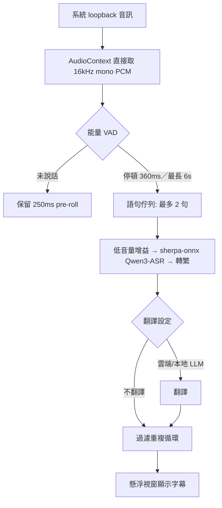

# VoiceInk

Windows 桌面 AI 工作台。**聊天**、**訂閱額度**、**檔案轉錄**、**即時字幕**、**翻譯與 TTS** 五件事放在同一個 App；語音相關功能可完全離線（本地模型、CPU 即時），也能改走雲端 API。

**v1.7.0** — [下載安裝檔](https://github.com/RX5950XT/VoiceInk/releases)

---

## 功能

### 聊天

走 OpenAI 相容端點（OpenRouter、本地 gateway 皆可）的多會話聊天。

- 逐字串流、可隨時停止；中斷前收到的內容照樣存檔
- 輸入框自動長高（最高佔畫面四成）、Enter 送出、Shift+Enter 換行
- 圖片輸入：貼上／拖放／選檔，最多 4 張，送出前縮到長邊 1568px
- 思考開關：開啟才帶 `reasoning_effort`，模型回傳的思考過程以可摺疊區塊呈現
- 系統提示可存多組，工具列下拉即時切換
- 每則訊息可複製，最後一則回覆可重新生成；側欄支援搜尋
- Markdown 為自寫渲染器（零 `innerHTML`、零第三方套件），程式碼區塊附複製鈕

聊天的 API URL／Key／模型清單與翻譯**完全獨立**——翻譯用便宜快模型、聊天用強模型，互不干擾。

### 額度儀錶板

集中查看 **Claude Code、Codex、Antigravity、OpenCode、Grok** 的已用額度與重置倒數。

- **只有按下「同步」才會連線**；啟動 App 與進頁只讀本機快取
- 卡片兩欄排列（窄視窗自動收成一欄），可直接抓著卡片拖曳排序：拖曳中卡片跟著游標且不會變半透明，其他卡片平滑推開，放開即歸位
- 鍵盤也能排序：Space 抓取、方向鍵移動、Enter／Space 放下、Esc 取消
- 可隱藏個別來源、調整 OpenCode 每週／每月重置時間，並查看已去敏的來源診斷

| 來源 | 取得方式 |
|---|---|
| Claude Code／Codex／Grok | 本機登入憑證 + 官方額度 API |
| Antigravity | Windows Credential Manager + Google cloudcode-pa，分列 Claude／Gemini 的 5 小時與每週視窗 |
| OpenCode | 唯讀 `opencode.db` 成本估算（明確標示非官方額度） |

憑證、原始 API 回應、任意 URL／路徑／SQL 都不會交給 renderer。

### 檔案轉錄

拖放音訊檔（MP3、WAV、M4A、FLAC、OGG、AAC…）即可轉錄。ffmpeg 串流解碼、28 秒一段，支援 **2 小時／100MB 以上**（上限 4 小時／200MB），不整檔塞進記憶體。完成後可直接翻譯、複製或存檔。

### 即時字幕

擷取電腦正在播放的任何聲音（YouTube、會議軟體…），直接取 16kHz mono PCM，由 VAD 在自然停頓處切句後轉錄與翻譯——沒有固定 2 秒硬切，也沒有錄音重啟造成的音訊缺口。

結果顯示在**置頂懸浮字幕視窗**：可拖動縮放、字級 A±、透明度切換、雙語／僅翻譯切換、一鍵複製全部。狀態列的音量條可確認是否擷取到聲音。

### 翻譯與 TTS

雙欄輸入／譯文版面，輸入**不限字數**（自動分段、可中途停止），⇄ 一鍵交換語言，Ctrl+Enter 送出。譯文可用 Edge TTS 朗讀，五語語音選擇、語速 -50…100。

---

## 模型

| 模型 | 大小 | 用途 |
|---|---|---|
| **Qwen3-ASR-0.6B** | 941 MB | 本地 ASR，52 語（含國／粵／閩語），中英夾雜與標點表現極佳 |
| **LinguaForge 0.8B Q8** | 774 MB | 本地翻譯（繁中／英／日）專用微調，預設 |
| LinguaForge 0.8B Q4 | 505 MB | 同一顆模型的小量化，CPU 約快 2.2×，代價是罕見英文專名可能被音譯 |
| Qwen3.5-0.8B | 508 MB | 本地翻譯，通用多語 |

- 設定頁一鍵下載（含進度、取消、刪除），存放於 `%APPDATA%/voiceink/models/`，可點擊直達資料夾
- NVIDIA 顯卡且 VRAM ≥6GB 可開 GPU 翻譯（cuda → vulkan → CPU 自動 fallback）
- 中文輸出自動轉繁體（台灣用語）
- **本地 ASR 只有 CPU**：sherpa-onnx 的 Windows 套件是 CPU-only 編譯，所以提供的是推論執行緒設定；要更快請改用雲端 ASR

---

## 設定

導覽最後一頁，左側分類 rail 一次顯示一區：

| 分區 | 內容 |
|---|---|
| 模型 | ASR 與本地翻譯模型的下載／刪除／開資料夾 |
| 翻譯 | 雲端 LLM（API URL／Key／模型 ID）或本地 LLM（選模型、GPU 開關） |
| 聊天 | 聊天專用的 API URL／Key／模型清單（系統提示改在聊天頁管理） |
| 語音轉文字 | 本地或雲端 ASR（雲端憑證與翻譯分開）；本地可調推論執行緒 |
| 外觀 | 深色／淺色主題 |
| 語音朗讀 | Edge TTS 五語語音與語速 |

---

## 介面

Aurora glass 視覺：深色為深灰綠底搭配冷藍／暖金光暈，淺色以淡藍／灰綠／米金對應。六個主頁與置頂字幕窗共用 12px 柔邊半透明 surface，支援 900px／560px 響應式版面與 `prefers-reduced-motion`。主視窗為 frameless，標題列與導覽合併。

導覽順序：**聊天（預設）｜額度｜檔案轉錄｜即時字幕｜翻譯與 TTS｜設定**

---

## 技術棧

- **Core**：Electron 35+、Node.js 22
- **前端**：Vite、Vanilla JS、HTML/CSS（無框架、無狀態管理、無動畫套件）
- **本地 ASR**：sherpa-onnx（ONNX Runtime，CPU int8）
- **翻譯**：node-llama-cpp（GGUF）／OpenAI 相容 chat completions
- **聊天**：OpenAI 相容 chat completions（SSE 串流）
- **額度**：Main-only provider adapters；Node 內建 `node:sqlite` 唯讀 OpenCode DB
- **TTS**：Edge TTS（需連網）
- **簡繁**：opencc-js（僅在偵測到簡體時才套詞彙表）

---

## 開發

```bash
npm install
npm run electron:dev     # 開發（vite + electron）
npm run electron:pack    # 免安裝預覽 → dist/win-unpacked/VoiceInk.exe
npm run electron:build   # NSIS 安裝檔 → dist/
```

> 打包前先關閉開著的 `dist/win-unpacked/VoiceInk.exe`，否則檔案被佔用會失敗。

常用驗證：

```bash
node scripts/test-usage.js            # 額度合約、bounded I/O、唯讀 SQLite、IPC 邊界
node scripts/test-markdown.js         # Markdown 渲染器 + XSS
node scripts/test-vad.js              # VAD 切句狀態機
npx electron scripts/e2e-chat.js      # 聊天（mock SSE server）
npx electron scripts/e2e-usage.js     # 本機五家真實來源
node scripts/e2e-cdp-smoke.js         # 打包版整體 UI
node scripts/e2e-visual-cdp.js        # 六頁 × 深淺 × 1440／900／560 視覺與 RWD
```

---

## 即時字幕流程


```mermaid
graph TD
    A[系統 loopback 音訊] --> B[AudioContext 直接取 16kHz mono PCM]
    B --> C{能量 VAD}
    C -- 未說話 --> X[保留 250ms pre-roll]
    C -- 停頓 360ms／最長 6s --> Q[語句佇列: 最多 2 句]
    Q --> E[低音量增益 → sherpa-onnx Qwen3-ASR → 轉繁]
    E --> T{翻譯設定}
    T -- 雲端/本地 LLM --> F[翻譯]
    T -- 不翻譯 --> G
    F --> G[過濾重複循環]
    G --> J[懸浮視窗顯示字幕]
```

---

架構與交接資訊見 [CONTEXT.md](./CONTEXT.md)，開發規範見 [CLAUDE.md](./CLAUDE.md) / [AGENTS.md](./AGENTS.md)，歷史教訓見 [tasks/lessons.md](./tasks/lessons.md)。

MIT License.
