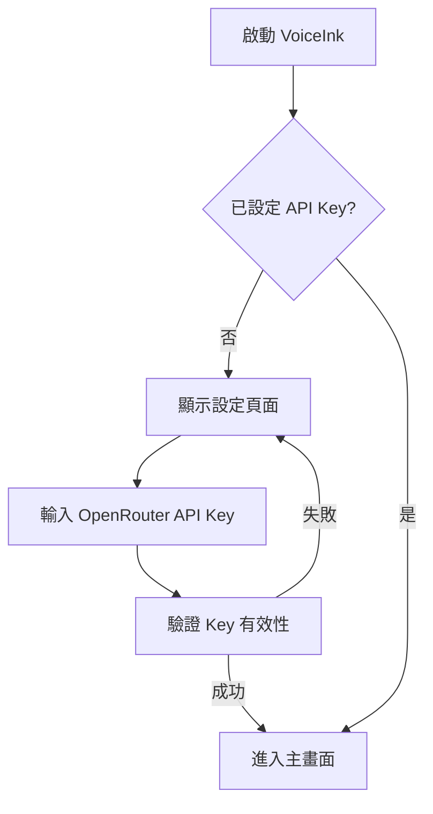
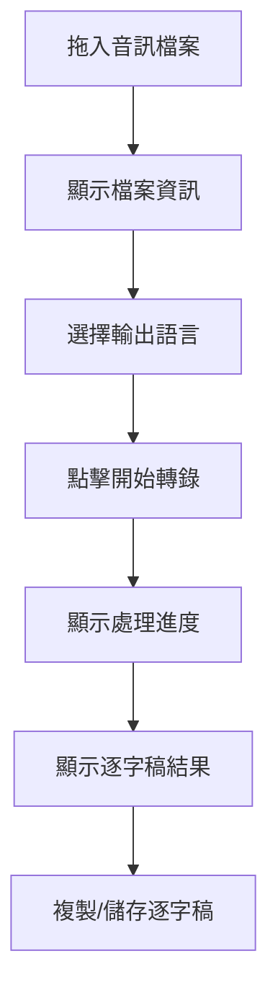
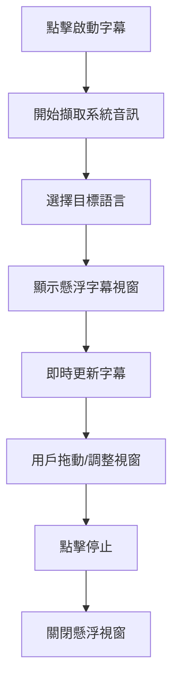

# 產品需求文件 (PRD)：VoiceInk MVP

> 📅 日期：2026-02-08
> 🎯 版本：MVP v1.0

---

## 1. 產品概述

### 1.1 產品定位
**VoiceInk** 是一款 Windows 桌面端語音轉文字工具，讓用戶能夠：
- 將音訊檔案轉換為高品質逐字稿
- 即時將系統播放的音訊轉為懸浮字幕

### 1.2 目標用戶
- 個人用戶（非技術背景）
- 需要整理會議錄音、Podcast、線上課程的人
- 需要即時字幕輔助觀看外語影片的人

### 1.3 核心價值
- 🧠 AI 驅動的智慧轉錄（過濾贅詞、預測模糊內容）
- 🌍 多語言自動偵測與翻譯
- 💫 簡潔優雅的使用體驗

---

## 2. 核心功能

### 2.1 功能列表

| 優先級 | 功能 | 說明 | MVP |
|--------|------|------|-----|
| P0 | API Key 設定 | 用戶輸入 OpenRouter API Key | ✅ |
| P0 | 音訊檔案轉錄 | 拖入檔案 → 生成逐字稿 | ✅ |
| P0 | 即時系統音訊字幕 | 擷取系統音訊 → 顯示懸浮字幕 | ✅ |
| P1 | 語言自動偵測 | 自動識別音訊語言 | ✅ |
| P1 | 輸出語言選擇 | 選擇逐字稿/字幕的目標語言 | ✅ |
| P1 | 深色/淺色模式 | 用戶切換主題 | ✅ |
| P2 | 逐字稿匯出 | 複製/儲存為 TXT | ✅ |
| P2 | 字幕樣式設定 | 字體大小、視窗透明度 | 🔜 |
| P3 | 歷史紀錄 | 保存歷次轉錄結果 | 🔜 |

---

## 3. 用戶流程

### 3.1 首次使用流程

### 3.2 音訊檔案轉錄流程

### 3.3 即時字幕流程

---

## 4. 使用者介面規格

### 4.1 主視窗

| 區域 | 內容 |
|------|------|
| 頂部導航列 | Logo、主題切換、設定按鈕 |
| 側邊欄 | 功能分頁：檔案轉錄、即時字幕 |
| 主內容區 | 根據分頁顯示對應功能 |

### 4.2 檔案轉錄頁面

- **拖放區**：大型拖放區域，支援點擊選檔
- **檔案資訊**：顯示檔名、時長、格式
- **語言選擇**：輸出語言下拉選單
- **進度條**：轉錄進度視覺化
- **結果區**：逐字稿文字區、複製/儲存按鈕

### 4.3 即時字幕頁面

- **啟動按鈕**：大型開始/停止按鈕
- **語言選擇**：目標翻譯語言
- **狀態指示**：顯示擷取中/已停止

### 4.4 懸浮字幕視窗

| 屬性 | 規格 |
|------|------|
| 尺寸 | 800 x 120 px（可調整） |
| 背景 | 純黑色 `#000000` |
| 文字 | 白色 `#FFFFFF` |
| 字體 | 微軟正黑體 (Microsoft JhengHei) |
| 字級 | 24px（預設） |
| 邊框 | 無 |
| 置頂 | 永遠在最上層 |
| 拖動 | 可自由拖動位置 |
| 縮放 | 可調整視窗寬度 |

### 4.5 深色/淺色模式

| 元素 | 深色模式 | 淺色模式 |
|------|----------|----------|
| 背景 | `#1a1a1a` | `#ffffff` |
| 卡片 | `#2d2d2d` | `#f5f5f5` |
| 文字 | `#ffffff` | `#1a1a1a` |
| 強調色 | `#6366f1` (Indigo) | `#4f46e5` |

---

## 5. 技術需求

### 5.1 支援格式
- MP3, WAV, M4A, FLAC, OGG, AAC, WMA, AIFF

### 5.2 支援語言（輸出）
- 繁體中文（台灣）- 預設
- 簡體中文
- English
- 日本語
- 한국어
- 其他（由 Gemini 自動支援）

### 5.3 系統需求
- Windows 10/11 (64-bit)
- 網路連線（API 呼叫）

---

## 6. 成功指標

| 指標 | 目標 |
|------|------|
| 轉錄準確率 | > 95%（清晰音訊） |
| 即時字幕延遲 | < 3 秒 |
| 應用程式啟動時間 | < 3 秒 |
| 安裝包大小 | < 200 MB |

---

## 7. 未納入 MVP 的功能（Future）

- 說話者辨識（Diarization）
- 時間戳記同步
- 快捷鍵控制
- 自動儲存歷史
- 批次檔案處理
- 自訂 Prompt 模板
